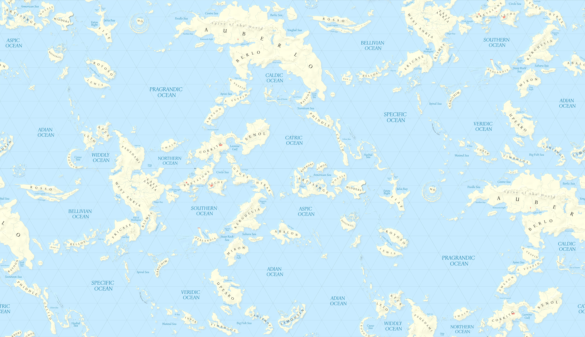

# A Map of Aerb's Prime Material Plane

This repo contains a map of Aerb, as described in *Worth the Candle*, by Alexander Wales. 
([Web serial link](https://www.royalroad.com/fiction/25137/worth-the-candle). [Audiobook link](https://www.amazon.com/Worth-Candle-Through-Adversity-Book/dp/B09QH9NW9V/).)

Please note that this map contains spoilers for the series.

## Mapping a Hexagonally Tiling World.

As described in [the worldbuilding document for the series](https://archiveofourown.org/works/20629112/chapters/48985139), Aerb isn't a round world, but rather a flat one which loops:

> Aerb can be represented as an infinitely tessellating hexagon with an edge length of approximately twenty-seven thousand miles and a surface area of 1.9 billion square miles. 

There are two problems I had to overcome when making a map that correctly represents this wonky cosmology.

The first problem was that while Leaflet has support for rectangularly looping maps, it lacks support for hexagonal loops 
(because why would you ever need that, if not for this exact purpose?)
Fortunately, a hexagonal tiling can be represented with rectangular tiles by making each rectangular tile have two copies of every point in the hex tiling.
This results in a map which looks like this:

If this image is rectangularly tiled, then the continents on it will be hexagonally tiled. Great!
If we don't need a *gigantic* map or anything fancy, we can set this as a background image to some element and call it a day.

But I do want a gigantic image, with panning and zooming,
and I don't want it to make my computer cry. 
To do this, I need to define how tiles are constructed for Leaflet. 
Here's where the second challenge appears.

The second problem is that ratio of width to height of the rectangular image above is sqrt(3), which makes things awkward when subdividing an image into regular tiles.
The solution I used was to make the tile images wider than necessary, include horizontal overlap in the tile images, 
and to use a secondary horizontal offset to compensate for the 'drift' between different instances of the hex.

